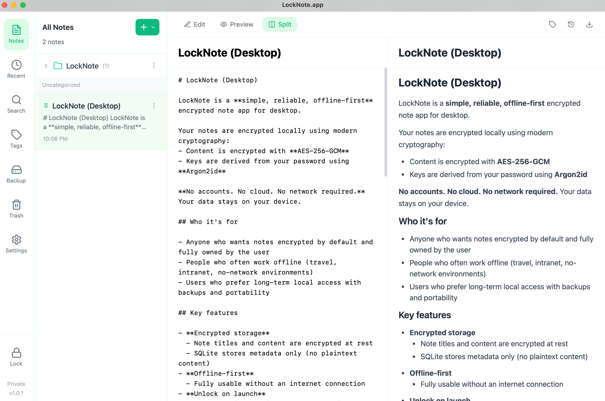

# LockNote.app

 English | [中文](./README.zh-CN.md)
 
 A simple, reliable, offline-first encrypted note-taking desktop app.

 Official Website: https://locknote.app

 Author: LockNote.app <support@locknote.app>

 

## Features

- **Encrypted storage** - All note content is encrypted with AES-256-GCM; keys are derived via Argon2id
- **Offline-first** - Data is stored locally; no network connection required
- **Markdown editing** - Markdown support with live preview
- **Tag management** - Add tags for classification and filtering
- **Full-text search** - Search titles, content, and tags
- **History versions** - Automatic history snapshots with rollback
- **Backup & restore** - Manual backup and restore supported

## Tech Stack

- **Backend**: Go + Wails v2
- **Frontend**: React + TypeScript + TailwindCSS
- **Database**: SQLite (metadata)
- **Crypto**: AES-256-GCM + Argon2id

## Development Requirements

- Go 1.21+
- Node.js 18+
- Wails CLI v2

## Install Wails CLI

```bash
go install github.com/wailsapp/wails/v2/cmd/wails@latest
```

## Development

```bash
# Install frontend dependencies
cd frontend && npm install && cd ..

# Run in dev mode
wails dev
```

## Build

```bash
# Build production bundle
wails build
```

## Windows Download & Run (Important)

The .zip/.exe downloaded from GitHub Releases may be marked as “from the Internet” (MOTW), which can cause:

- “Windows protected your PC” (SmartScreen)
- Slow or stuck first launch (security scan + WebView2 initialization)

Workarounds (choose one):

1) Recommended: Unblock the zip first, then extract

- Right click zip -> Properties -> Unblock -> Apply

2) Or: Unblock the exe after extraction

- Right click exe -> Properties -> Unblock -> Apply

3) PowerShell (optional):

```powershell
Unblock-File .\LockNote.exe
# Or unblock everything in the extracted folder:
Get-ChildItem -Recurse | Unblock-File
```

## Project Structure

```
locknote/
├── main.go                 # Entry
├── app.go                  # App core logic
├── api.go                  # API methods
├── internal/
│   ├── crypto/             # Crypto module
│   ├── database/           # SQLite database
│   ├── notes/              # Notes service
│   ├── tags/               # Tags service
│   └── backup/             # Backup service
├── frontend/
│   ├── src/
│   │   ├── components/     # React components
│   │   ├── store/          # Zustand state
│   │   └── wailsjs/        # Wails bindings
│   └── ...
└── docs/
    └── 功能.md             # Requirements
```

## Security Notes

- Master key only resides in memory after unlocking
- Each note uses an independent random nonce
- Ciphertext files use atomic write
- Password reset supported via recovery key

## Version

v1.0.3

## License

MIT. See [LICENSE](./LICENSE).
