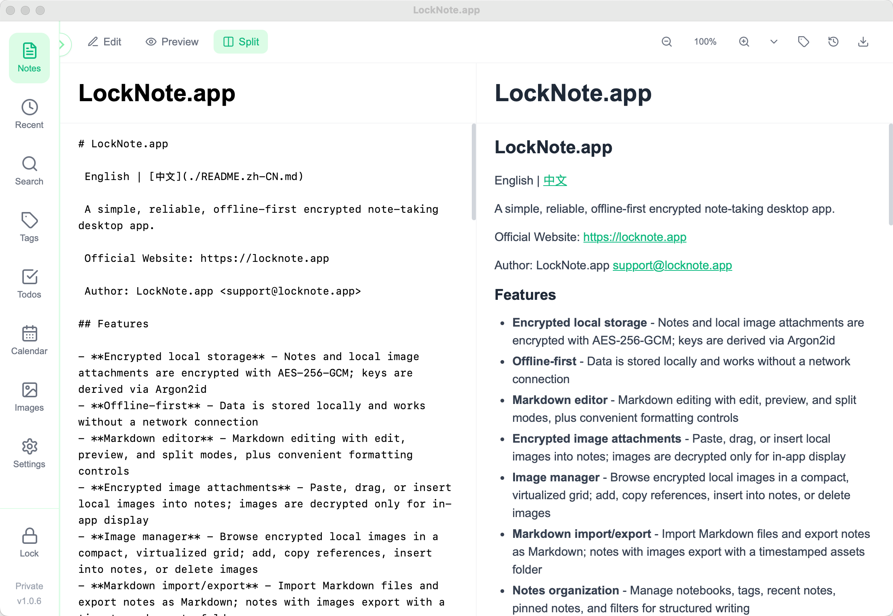

# LockNote.app

English | [中文](./README.zh-CN.md)

A simple, reliable, offline-first encrypted note-taking desktop app for Windows, macOS, and Linux.

Official Website: https://locknote.app

Author: LockNote.app <support@locknote.app>



## Features

- **Cross-platform desktop app** - Release packages are provided for Windows x64, macOS Apple Silicon, macOS Intel, and Linux x64
- **Encrypted local storage** - Notes and local image attachments are encrypted with AES-256-GCM; keys are derived via Argon2id
- **Offline-first** - Data is stored locally and works without a network connection
- **Markdown editor** - Markdown editing with edit, preview, and split modes, optional line numbers, and convenient formatting controls
- **Encrypted image attachments** - Paste, drag, or insert local images into notes; images are decrypted only for in-app display
- **Image manager** - Browse encrypted local images in a compact, virtualized grid; add, copy references, insert into notes, or delete images
- **Markdown import/export** - Import Markdown files and export notes as Markdown; notes with images export with a timestamped assets folder
- **Notes organization** - Manage notebooks, tags, recent notes, pinned notes, and filters for structured writing
- **Todos** - Manage standalone tasks with priorities, due dates, subtasks, filters, and inline editing
- **Calendar view** - View note creation/edit activity, due todos, and completed todos by date
- **HeatMap activity view** - GitHub-style activity heatmap based on note activity and completed todos
- **Full-text search** - Search note titles, content, and tags
- **Version history** - Automatic history snapshots with rollback
- **Trash** - Deleted notes move to trash and can be restored or permanently deleted
- **Backup & restore** - Create encrypted backups, restore data, and import backups with a data key
- **Startup experience** - Faster Windows cold-start flow, startup progress, and first-run feature introduction
- **Security settings** - Auto-lock dialog, password change dialog, data-key recovery, themes, and language switching

## Tech Stack

- **Backend**: Go + Wails v2
- **Frontend**: React + TypeScript + TailwindCSS
- **Storage**: SQLite (metadata) + local encrypted files (note content and image attachments)
- **Crypto**: AES-256-GCM + Argon2id

## Development Requirements

- Go 1.24+
- Node.js 18+
- Wails CLI v2
- Platform build tools required by Wails for your operating system

## Install Wails CLI

```bash
go install github.com/wailsapp/wails/v2/cmd/wails@latest
```

## Development

```bash
cd frontend
npm install
cd ..

wails dev
```

## Build

```bash
wails build
```

For platform-specific builds, use the helper script:

```bash
./build.sh darwin arm64
./build.sh darwin amd64
./build.sh windows amd64
./build.sh linux amd64
./build.sh all
```

See [build.md](./build.md) and [build.sh](./build.sh) for additional build options.

## Download & Run

Download the zip package for your system from [GitHub Releases](https://github.com/JackyZhang8/locknote/releases).

| System | Release asset | How to run |
| --- | --- | --- |
| Windows x64 | `locknote-windows-amd64.zip` | Extract and run `LockNote.exe` |
| macOS Apple Silicon | `locknote-darwin-arm64.zip` | Extract and open `LockNote.app` |
| macOS Intel | `locknote-darwin-amd64.zip` | Extract and open `LockNote.app` |
| Linux x64 | `locknote-linux-amd64.zip` | Extract and run `./LockNote` |

### Windows Notes

The .zip/.exe downloaded from GitHub Releases may be marked as "from the Internet" (MOTW), which can cause:

- "Windows protected your PC" (SmartScreen)
- Slow or stuck first launch (security scan + WebView2 initialization)

Workarounds (choose one):

1. Recommended: Unblock the zip first, then extract

   - Right click zip -> Properties -> Unblock -> Apply

2. Or: Unblock the exe after extraction

   - Right click exe -> Properties -> Unblock -> Apply

3. PowerShell (optional):

```powershell
Unblock-File .\LockNote.exe
# Or unblock everything in the extracted folder:
Get-ChildItem -Recurse | Unblock-File
```

### macOS Notes

- Use `locknote-darwin-arm64.zip` for Apple Silicon Macs and `locknote-darwin-amd64.zip` for Intel Macs.
- Release builds are packaged as `LockNote.app`.
- If macOS still blocks the app, open System Settings -> Privacy & Security and allow the app there. Only use this for packages downloaded from the official release page.

### Linux Notes

```bash
unzip locknote-linux-amd64.zip
chmod +x LockNote
./LockNote
```

Linux builds require GTK 3 and WebKitGTK runtime libraries. Package names vary by distribution; on Ubuntu/Debian they are typically installed with:

```bash
sudo apt install libgtk-3-0 libwebkit2gtk-4.0-37
```

## Project Structure

```
locknote/
├── main.go                 # Entry
├── app.go                  # App core logic
├── api.go                  # API methods
├── utils.go                # Shared helpers
├── build.sh                # Multi-platform build helper
├── build.md                # Build notes
├── internal/
│   ├── attachments/        # Encrypted image attachments
│   ├── backup/             # Backup service
│   ├── core/               # Shared domain types
│   ├── crypto/             # Crypto module
│   ├── database/           # SQLite database
│   ├── notebooks/          # Notebook service
│   ├── notes/              # Notes service
│   ├── smartviews/         # Smart views
│   ├── tags/               # Tags service
│   └── todos/              # Todo service
├── mobile/                 # Mobile bridge package
├── frontend/
│   ├── src/
│   │   ├── components/     # React components
│   │   ├── i18n/           # Localization resources
│   │   ├── store/          # Zustand state
│   │   └── assets/         # Frontend assets
│   ├── wailsjs/            # Generated Wails bindings
│   └── ...
└── docs/
    ├── INTRO.en.md         # English introduction
    └── INTRO.zh-CN.md      # Chinese introduction
```

## Security Notes

- Master key only resides in memory after unlocking
- Each note uses an independent random nonce
- Ciphertext files use atomic write
- Password reset supported via recovery key
- If you lose both your login password and the recovery key, your data cannot be recovered

## Version

v1.0.7

## License

MIT. See [LICENSE](./LICENSE).
