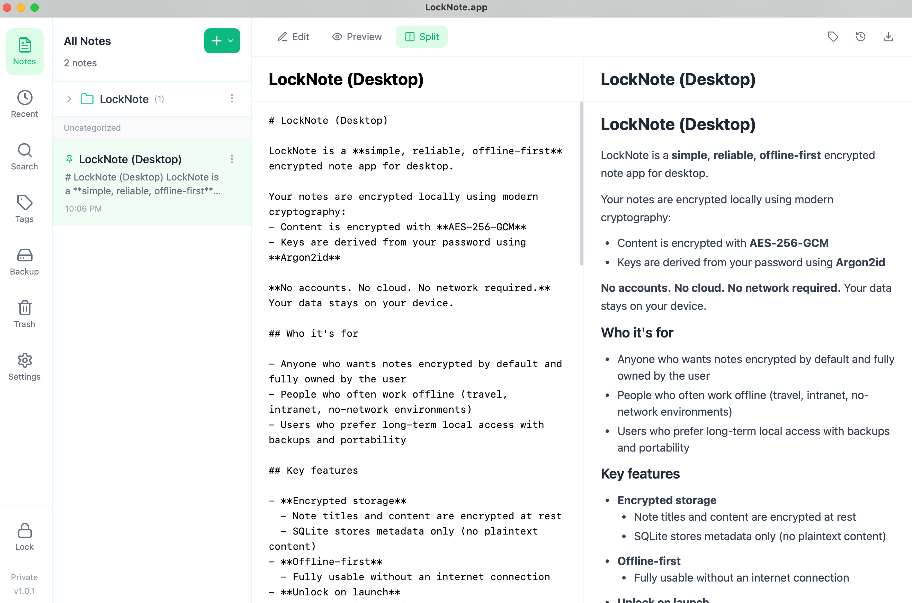

# LockNote.app

[English](./README.md) | 中文

一个简单、可靠、离线优先的桌面加密笔记软件。

 Official Website: https://locknote.app

 Author: LockNote.app <support@locknote.app>

 

## 功能特性

- **本地加密存储** - 笔记内容和本地图片附件使用 AES-256-GCM 加密，密钥由 Argon2id 派生
- **离线优先** - 数据存储在本地，无需网络连接也可使用
- **Markdown 编辑器** - 支持编辑、预览、分屏模式，并提供常用格式化工具
- **加密图片附件** - 支持粘贴、拖入或插入本地图片；图片仅在软件内显示时解密
- **图片管理** - 以紧凑虚拟列表浏览本地加密图片，支持添加、复制引用、插入笔记和删除
- **Markdown 导入导出** - 支持导入 Markdown；含图片笔记导出时自动生成带时间戳的 assets 文件夹
- **笔记组织** - 支持笔记本、标签、最近编辑、置顶笔记和筛选管理
- **待办管理** - 支持独立待办、优先级、截止时间、子任务、筛选和行内编辑
- **全文搜索** - 搜索笔记标题、内容和标签
- **历史版本** - 自动保存历史版本，支持回滚
- **回收站** - 删除的笔记进入回收站，可恢复或永久删除
- **备份恢复** - 支持创建加密备份、恢复数据，以及使用数据密钥导入备份
- **安全设置** - 支持自动锁定、修改密码、数据密钥恢复、主题和语言切换

## 技术栈

- **后端**: Go + Wails v2
- **前端**: React + TypeScript + TailwindCSS
- **数据库**: SQLite (元数据)
- **加密**: AES-256-GCM + Argon2id

## 开发环境要求

- Go 1.21+
- Node.js 18+
- Wails CLI v2

## 安装 Wails CLI

```bash
go install github.com/wailsapp/wails/v2/cmd/wails@latest
```

## 开发

```bash
# 安装前端依赖
cd frontend && npm install && cd ..

# 开发模式运行
wails dev
```

## 构建

```bash
# 构建生产版本
wails build
```

## Windows 下载与运行（重要）

从 GitHub Release 下载的 .zip/.exe 可能会被 Windows 标记为“来自互联网”(MOTW)，导致：

- 弹出“Windows 已保护你的电脑”(SmartScreen)
- 第一次启动较慢/卡住（安全扫描 + WebView2 初始化）

解决办法（任选其一）：

1) 推荐：先对 zip 解除锁定，再解压

- 右键 zip -> 属性 -> 勾选/点击“解除锁定(Unblock)” -> 应用

2) 或者：解压后对 exe 解除锁定

- 右键 exe -> 属性 -> “解除锁定(Unblock)” -> 应用

3) PowerShell（可选）：

```powershell
Unblock-File .\LockNote.exe
# 或对整个解压目录：
Get-ChildItem -Recurse | Unblock-File
```

## 项目结构

```
locknote/
├── main.go                 # 应用入口
├── app.go                  # 应用核心逻辑
├── api.go                  # API 方法
├── internal/
│   ├── crypto/            # 加密模块
│   ├── database/          # SQLite 数据库
│   ├── notes/             # 笔记服务
│   ├── tags/              # 标签服务
│   └── backup/            # 备份服务
├── frontend/
│   ├── src/
│   │   ├── components/    # React 组件
│   │   ├── store/         # Zustand 状态管理
│   │   └── wailsjs/       # Wails 绑定
│   └── ...
└── docs/
    └── 功能.md            # 需求文档
```

## 安全说明

- 主密钥仅在解锁后驻留内存
- 每篇笔记使用独立随机 nonce
- 密文文件采用原子写入
- 支持恢复密钥重置密码

## 版本

v1.0.5

## License

MIT。See [LICENSE](./LICENSE).
