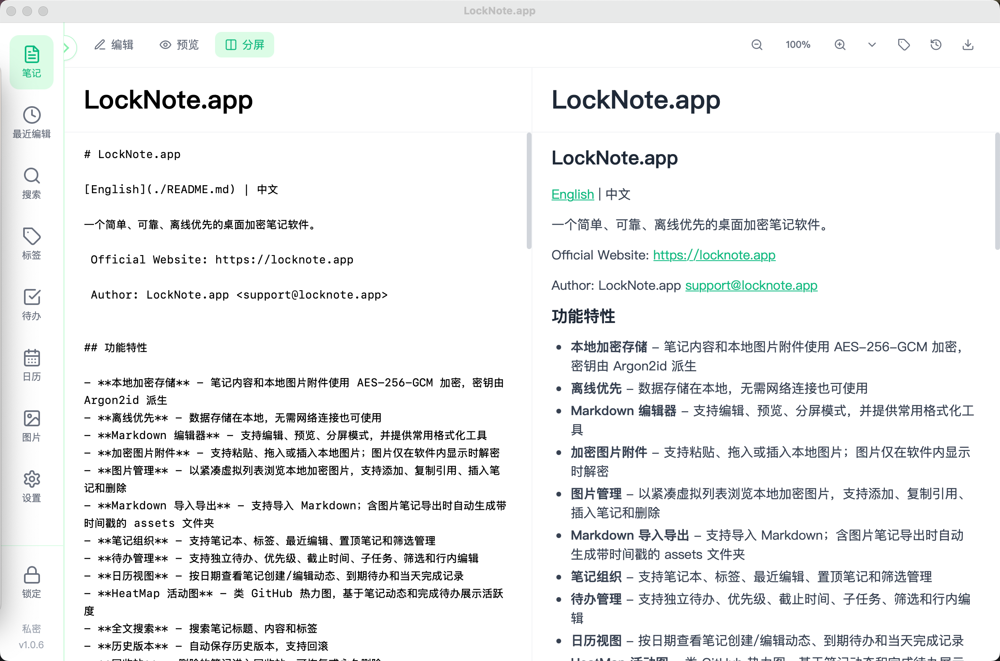

# LockNote.app

[English](./README.md) | 中文

一个简单、可靠、离线优先，支持 Windows、macOS 和 Linux 的桌面加密笔记软件。

官方网站：https://locknote.app

作者：LockNote.app <support@locknote.app>



## 功能特性

- **多平台桌面应用** - 发布包覆盖 Windows x64、macOS Apple Silicon、macOS Intel 和 Linux x64
- **本地加密存储** - 笔记内容和本地图片附件使用 AES-256-GCM 加密，密钥由 Argon2id 派生
- **离线优先** - 数据存储在本地，无需网络连接也可使用
- **Markdown 编辑器** - 支持编辑、预览、分屏模式、可选行号，并提供常用格式化工具
- **加密图片附件** - 支持粘贴、拖入或插入本地图片；图片仅在软件内显示时解密
- **图片管理** - 以紧凑虚拟列表浏览本地加密图片，支持添加、复制引用、插入笔记和删除
- **Markdown 导入导出** - 支持导入 Markdown；含图片笔记导出时自动生成带时间戳的 assets 文件夹
- **笔记组织** - 支持笔记本、标签、最近编辑、置顶笔记和筛选管理
- **待办管理** - 支持独立待办、优先级、截止时间、子任务、筛选和行内编辑
- **日历视图** - 按日期查看笔记创建/编辑动态、到期待办和当天完成记录
- **HeatMap 活动图** - 类 GitHub 热力图，基于笔记动态和完成待办展示活跃度
- **全文搜索** - 搜索笔记标题、内容和标签
- **历史版本** - 自动保存历史版本，支持回滚
- **回收站** - 删除的笔记进入回收站，可恢复或永久删除
- **备份恢复** - 支持创建加密备份、恢复数据，以及使用数据密钥导入备份
- **启动体验** - 优化 Windows 首次冷启动，增加启动进度页和首次使用功能介绍
- **安全设置** - 支持自动锁定弹窗、修改密码弹窗、恢复密钥、主题和语言切换

## 技术栈

- **后端**: Go + Wails v2
- **前端**: React + TypeScript + TailwindCSS
- **存储**: SQLite（元数据）+ 本地密文文件（笔记内容和图片附件）
- **加密**: AES-256-GCM + Argon2id

## 开发环境要求

- Go 1.24+
- Node.js 18+
- Wails CLI v2
- 当前系统对应的 Wails 平台构建工具

## 安装 Wails CLI

```bash
go install github.com/wailsapp/wails/v2/cmd/wails@latest
```

## 开发

```bash
cd frontend
npm install
cd ..

wails dev
```

## 构建

```bash
wails build
```

如需按平台构建，可使用辅助脚本：

```bash
./build.sh darwin arm64
./build.sh darwin amd64
./build.sh windows amd64
./build.sh linux amd64
./build.sh all
```

更多构建参数见 [build.md](./build.md) 和 [build.sh](./build.sh)。

## 下载与运行

请从 [GitHub Releases](https://github.com/JackyZhang8/locknote/releases) 下载对应系统的 zip 包。

| 系统 | 发布文件 | 运行方式 |
| --- | --- | --- |
| Windows x64 | `locknote-windows-amd64.zip` | 解压后运行 `LockNote.exe` |
| macOS Apple Silicon | `locknote-darwin-arm64.zip` | 解压后打开 `LockNote.app` |
| macOS Intel | `locknote-darwin-amd64.zip` | 解压后打开 `LockNote.app` |
| Linux x64 | `locknote-linux-amd64.zip` | 解压后执行 `./LockNote` |

### Windows 注意事项

从 GitHub Release 下载的 .zip/.exe 可能会被 Windows 标记为“来自互联网”(MOTW)，导致：

- 弹出“Windows 已保护你的电脑”(SmartScreen)
- 第一次启动较慢/卡住（安全扫描 + WebView2 初始化）

解决办法（任选其一）：

1. 推荐：先对 zip 解除锁定，再解压

   - 右键 zip -> 属性 -> 勾选/点击“解除锁定(Unblock)” -> 应用

2. 或者：解压后对 exe 解除锁定

   - 右键 exe -> 属性 -> “解除锁定(Unblock)” -> 应用

3. PowerShell（可选）：

```powershell
Unblock-File .\LockNote.exe
# 或对整个解压目录：
Get-ChildItem -Recurse | Unblock-File
```

### macOS 注意事项

- Apple Silicon 机型使用 `locknote-darwin-arm64.zip`，Intel 机型使用 `locknote-darwin-amd64.zip`。
- 发布包内是 `LockNote.app`。
- 如果 macOS 仍拦截启动，可在“系统设置 -> 隐私与安全性”中允许打开。请只对官方 Release 页面下载的包执行该操作。

### Linux 注意事项

```bash
unzip locknote-linux-amd64.zip
chmod +x LockNote
./LockNote
```

Linux 版本需要 GTK 3 和 WebKitGTK 运行库。不同发行版包名可能不同；Ubuntu/Debian 通常可使用：

```bash
sudo apt install libgtk-3-0 libwebkit2gtk-4.0-37
```

## 项目结构

```
locknote/
├── main.go                 # 应用入口
├── app.go                  # 应用核心逻辑
├── api.go                  # API 方法
├── utils.go                # 通用辅助方法
├── build.sh                # 多平台构建脚本
├── build.md                # 构建说明
├── internal/
│   ├── attachments/        # 加密图片附件
│   ├── backup/             # 备份服务
│   ├── core/               # 共享领域类型
│   ├── crypto/             # 加密模块
│   ├── database/           # SQLite 数据库
│   ├── notebooks/          # 笔记本服务
│   ├── notes/              # 笔记服务
│   ├── smartviews/         # 智能视图
│   ├── tags/               # 标签服务
│   └── todos/              # 待办服务
├── mobile/                 # 移动端桥接包
├── frontend/
│   ├── src/
│   │   ├── components/     # React 组件
│   │   ├── i18n/           # 多语言资源
│   │   ├── store/          # Zustand 状态管理
│   │   └── assets/         # 前端资源
│   ├── wailsjs/            # 生成的 Wails 绑定
│   └── ...
└── docs/
    ├── INTRO.en.md         # 英文介绍
    └── INTRO.zh-CN.md      # 中文介绍
```

## 安全说明

- 主密钥仅在解锁后驻留内存
- 每篇笔记使用独立随机 nonce
- 密文文件采用原子写入
- 支持恢复密钥重置密码
- 如果你同时遗失登录密码和恢复密钥，数据将无法恢复

## 版本

v1.0.7

## 许可证

MIT。详见 [LICENSE](./LICENSE)。
